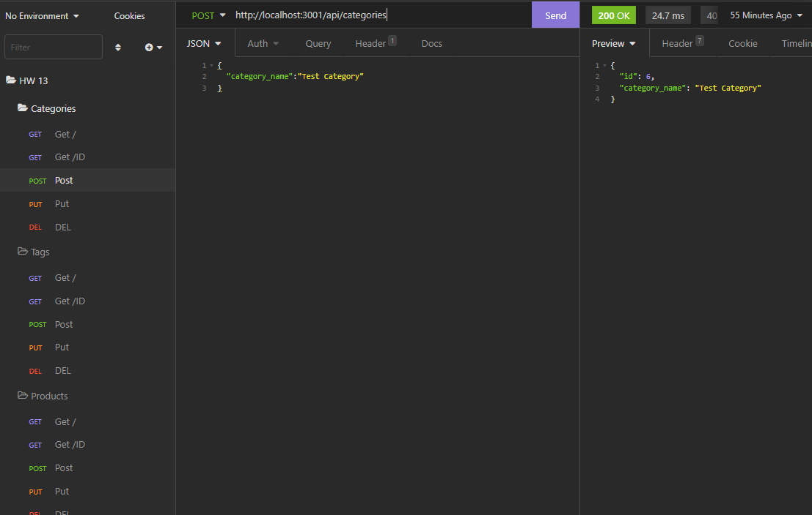

## E-Commerce Back-End

  
  
 
  ## Table of Contents
  - [Description](#description)
  - [Installation](#nstallation)
  - [Contributors](#contributors)
  - [Usage](#usage)
  - [Tests](#tests)
  - [Questions](#questions)

  ## Description
  This is database using sequilize to create and edit all the routes for categories, tags and products. This backend can be used to track several parameters and 
  is user friendly.
  ## License
        This license was used for this application
  
  

  ## Installation
  NPM i for all depencies. Requires mysql2 and sequilize. First sign into mysql2 and source schema, after that seeds can be run and finally the server can be started. Insomnia was used to display all information.
  ## Contributors
  Email me if you would like to contribute
  ## Usage
  Uses sequlize to track routes in the api folder. Can seed data entered into the program
  ## Tests
  None 
  ## Links
  - Walkthrough Video: https://youtu.be/AHMFZzG4jYI
  - GitHub: RafaelH731
  - Email: rafaelherrera731@gmail.com
  

  ## Screenshots
  - 
  - 

